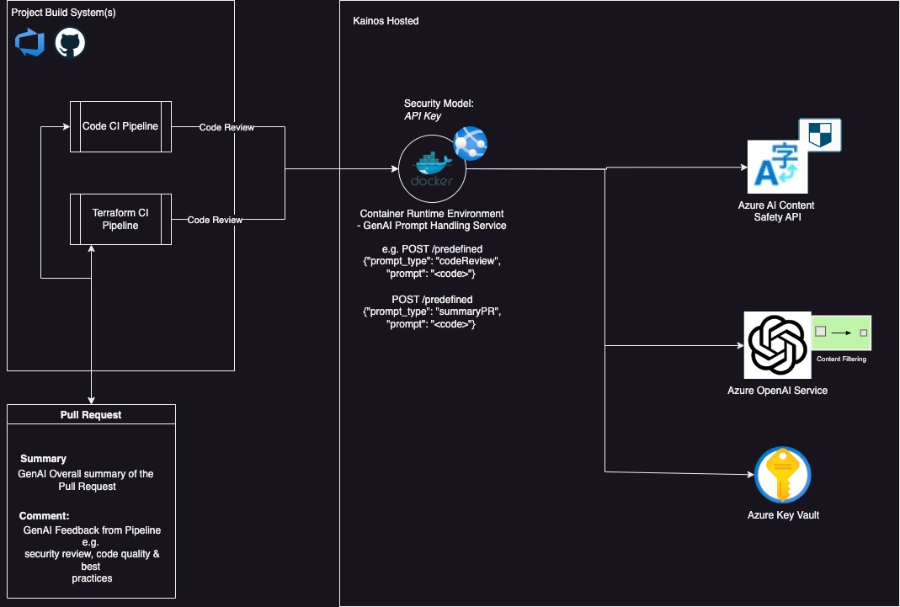
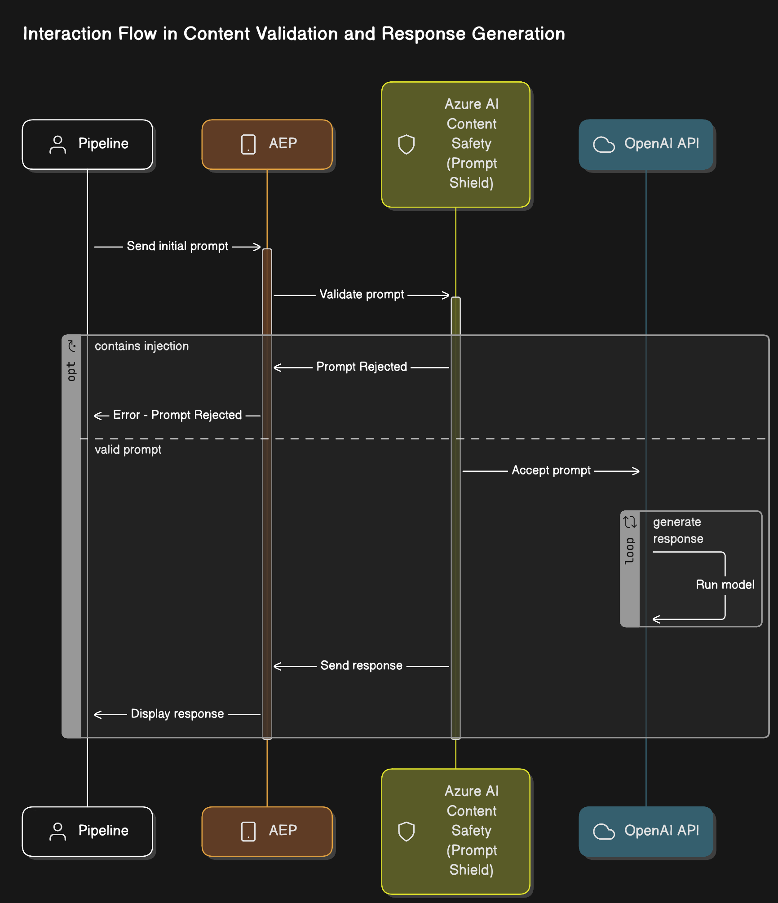

# Design Documentation

## HLD - Design

The following diagram illustrates the high-level design of the AEP API that is deployed in Azure:

## Application flow

The diagram below illustrates the flow of the AEP application from the pipeline's perspective. It showcases the interaction between the various components of the application and details the process when a prompt injection occurs within the flow.

## AEP Costs Summary (March 31 - April 29) 💰

| Azure Resource                           | SKU/Size                                     | Cost    |
|------------------------------------------|----------------------------------------------|---------|
| Azure App Service Plan                   | B2: 2 Cores, 3.5 GB Ram, 10GB Storage (£0.0.29) | £21.32  |
| Storage Account/Log Analytics (PAYG)     | StorageV2/ LRS                               | £10.13  |
| Azure Open AI                            | PAYG                                         | £5.87   |
| Key Vault                                | Standard                                     | £0.18   |
| **Total**                                |                                              | **£37.50** |

**Additional Azure Resources with no cost currently**
- Managed Identities x2 (N/A)

### Typical Cost to Run

Running AEP typically costs approximately £37.50 for the period from March 31 to April 29. However, costs may vary depending on usage patterns and additional services utilised.

**Note:** The costs associated with Azure Open AI are currently listed as PAYG. Please be aware that these costs may increase in the future due to token usage, and any additional charges will be added later.

