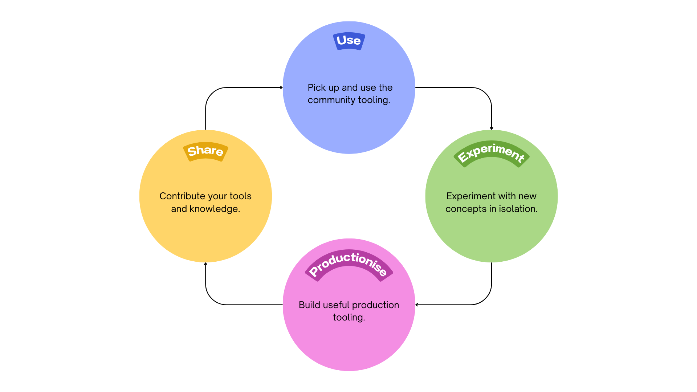
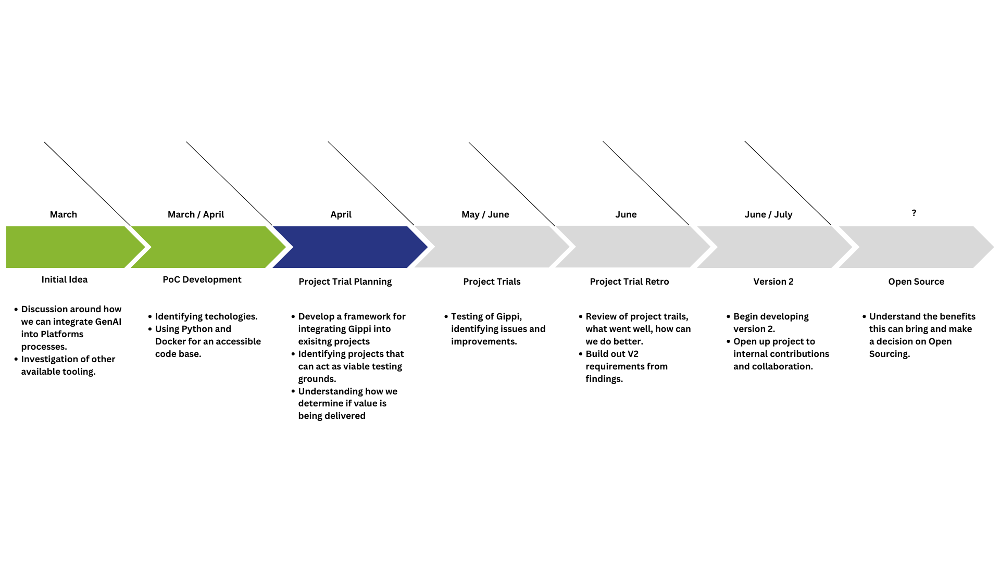

# Introduction

Welcome to AI Enhanced Platform (AEP), your companion to seamlessly interact with large language models. 

Empower your DevOps journey with AI-driven insights and assistance. 🚀

## What is AEP?

We know that engineers and architects want to build AI-backed tooling, but they don't always have the time or resources to do so. That's where AEP comes in. AEP is a platform that provides your project with easy-to-use Generative AI workflows, and a framework to experiment with your own. 

If you're looking to support engineers in the use of, and ability to build, AI-driven tooling, read our [Hosting Guide](hosting-guide.md).

### AEP Pillars

The three pillars of AEP are:

- A pre-built set of templates, tools and examples to get started.
- We provide you with the assurance, messaging and guidance to help your engineers and customers understand the tools.
- A framework to build and share your own AEP-integrated tools and templates.

### User Journey

We see the journey like this:

### Features

Currently, AEP supports the following:

* AI-Driven Pull Request Summary: Get a summary of your pull request using AI.
  * Azure DevOps
  * GitHub Actions
* AI-Driven Pull Request Summary With Board Context: Get a summary of your pull request and an analysis of its done status based on the linked work
  * Azure DevOps + Azure Boards
* AI-Driven Pull Request Review With Board Context: Get a review of your codes completeness as well as security, best practice and quality advice.
  * Azure DevOps + Azure Boards
* AI-Driven Pull Request Review: Get AI-driven insights on your pull request changes.
  * Azure DevOps
  * GitHub Actions
* Custom AI-Driven Prompts: Tailor prompts to your specific needs using custom system and user prompts for precise model guidance.
  * Build System Agnostic

### Roadmap

